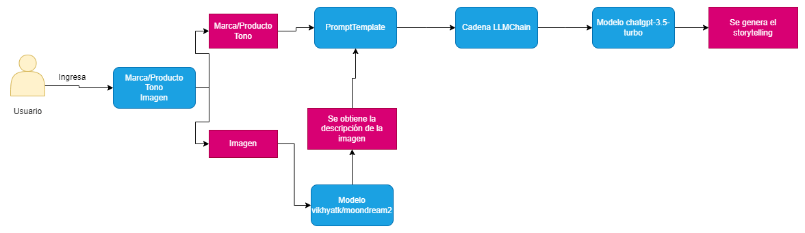
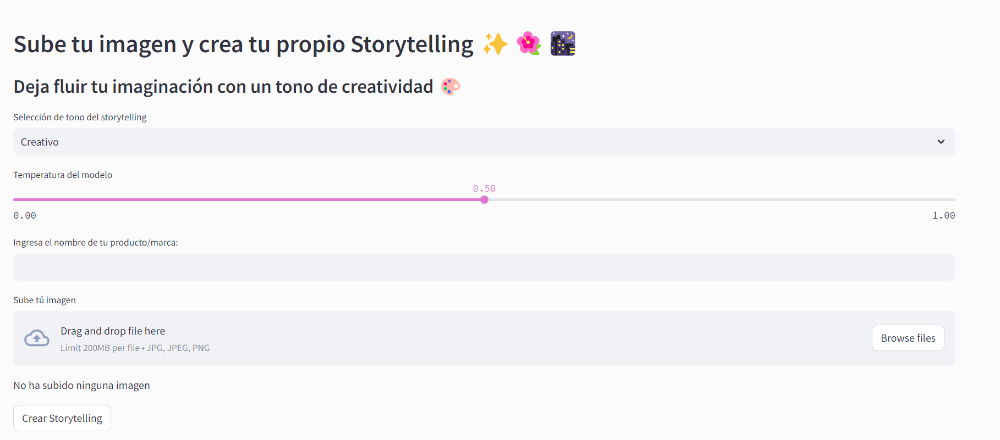
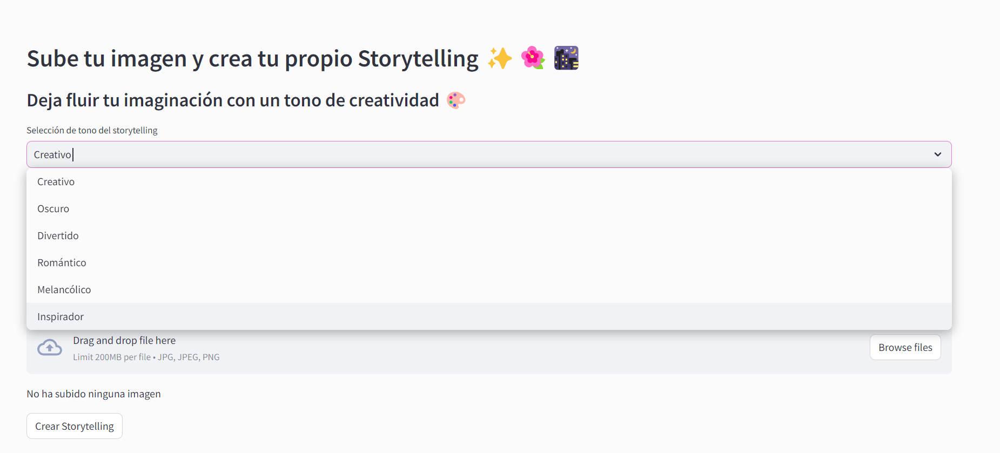
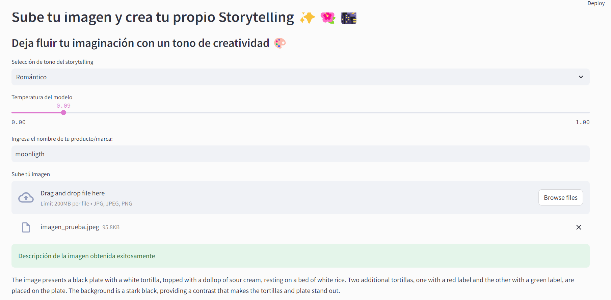
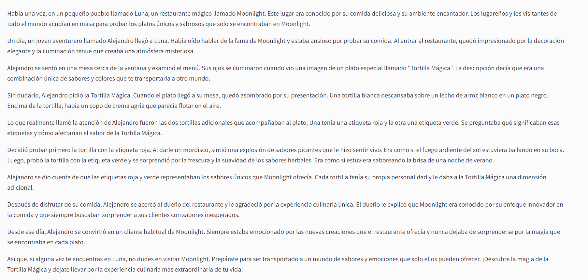

# storytelling_GENAI

## Objetivo: Crear una aplicación que sea capaz de crear un storytelling en base a un nombre de marca o producto, descripción de una imagen ingresada por el usuario y por el tipo de tono del storytelling ingresado por el usuario.

# Lógica de la aplicación

# Capturas:

* Interfaz de la aplicación:

* Tipos de tono del storytelling

* Funcionamiento del primer modelo <b>vikhyatk/moondream2</b>

* Funcionamiento del segundo modelo <b>chatgpt-3.5-turbo</b>

# Herramientas utilizadas:

* Python 3.12.2 como backend
* Streamlit para la interfaz
* pip para gestionar librerias y dependencias
* Langchain como framework base de la aplicación
* OpenAI para generar el storytelling en base a distintos templates
* Modelo open source de la comunidad HuggingFace moondream2 para obtener las descripciones de las imágenes en ingles

